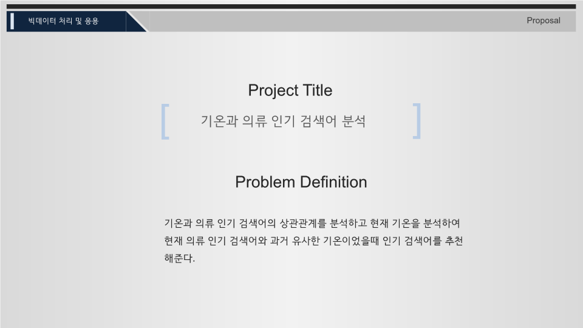
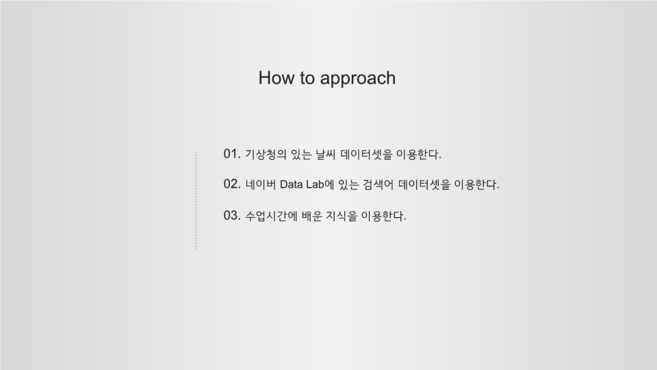
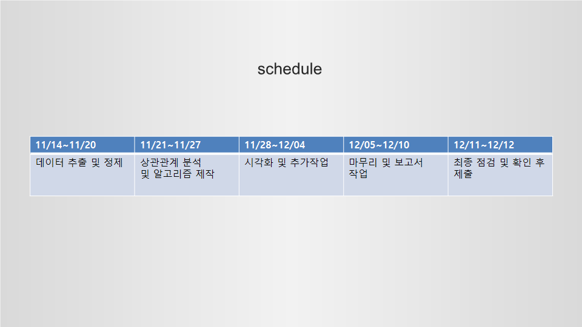

# MyFirstBigdataProject

학부생 마지막 학기때 수강한 빅데이터 수업에서 진행한 프로젝트입니다.

## 지정주제

네이버와 다음의 실시간 검색어 순위 비교(검색어 기록비교)

자동 크롤링

다음 실시간 이슈,  네이버 급상승 검색어,  구글 일별인기 급상승 검색, 연관성 분석

포털사이트별 상관관계

포털별 순위차이가 가장 큰 /작은 검색어 분석

## 자유주제 

**이용해야 하는 기능들**

크롤링 ( web에서 data 가져오기)

실시간 자동화

데이터 처리

데이터 추출

데이터 행렬변경

두개이상의 서로다른 data를 읽어서 pandas에서 병합하여 처리 (상관관계)

---

ppt에는 시연영상이 있습니다.

